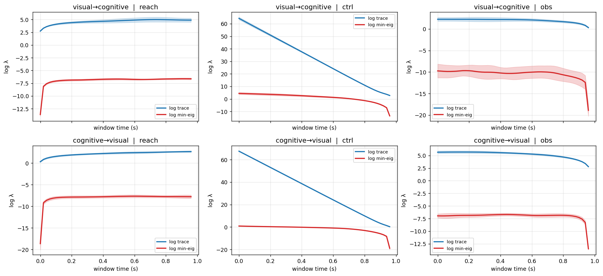

# WMTask Cross-Area Gramian Analysis — 2026-04-14

Ground-truth Jacobians (via `eq.jac`) of the trained `init_mode_random` biological RNN used across the WMTask experiments, analysed as an LTV control system. For each ordered pair `(source → target)` of areas (visual = idx 0–63, cognitive = idx 64–127), the state is the target, the input and the output are the source. Reachability / controllability / observability Gramians are computed on rolling windows with the rescaled square-root QR algorithm in `JacobianODE.control`.

## Configuration

- Trajectories analysed: **128**
- Trajectory length T: **49**
- Window size / stride: **49 / 49**
- Windows per trajectory: **1** (total batch = 128)
- dt: **0.02**
- Rescaled square-root QR: **True**

## Time series (log trace / log min eig, mean ± std over windows)

## Terminal-step summary

| pair | gramian | log_trace_final ± std | log_min_final ± std |
|------|---------|-----------------------|---------------------|
| visual→cognitive | reach | +4.893 ± 0.385 | -6.624 ± 0.172 |
| visual→cognitive | ctrl | +2.787 ± 0.051 | -13.473 ± 0.200 |
| visual→cognitive | obs | +0.321 ± 0.138 | -18.894 ± 1.338 |
| cognitive→visual | reach | +2.678 ± 0.178 | -7.771 ± 0.384 |
| cognitive→visual | ctrl | +0.321 ± 0.138 | -18.894 ± 1.338 |
| cognitive→visual | obs | +2.787 ± 0.051 | -13.473 ± 0.200 |

## Reading the figure

- **Blue (log trace)** grows roughly linearly when the target block has net-positive Lyapunov content driven by the source; slope proportional to the dominant local growth rate.
- **Red (log min-eig)** is the smallest eigenvalue of the Gramian. Large spread between trace and min-eig indicates the system is *directionally* controllable / observable — only a few modes in the target block are reached / seen through the source coupling.
- Compare **reach** vs **ctrl** panels: reach grows forward (what can the source reach in the target starting from zero), ctrl is the dual backward integral (what source history is needed to steer the target to origin). For stable forward blocks these should be similar; for unstable or chaotic target dynamics they can differ sharply.
- **Obs** panel uses `C = J_{source,target}` — how target state projects back into the source area. A large obs Gramian means the target's dynamics are visible through the source's observations over the window.

## Notes / caveats

- Ground-truth Jacobians come directly from the trained RNN's autograd `eq.jac`, so these numbers describe the **actual** local dynamics of the reference model — no learned-Jacobian-MLP approximation involved.
- A small batch (N_BATCH runs) is used for speed. Trends should be stable under increasing N_BATCH; std bands indicate window-to-window variability.
- Rescaled square-root form: log-spectra are exact log-eigenvalues of the true Gramian (not approximate), so cross-time comparisons are valid.
